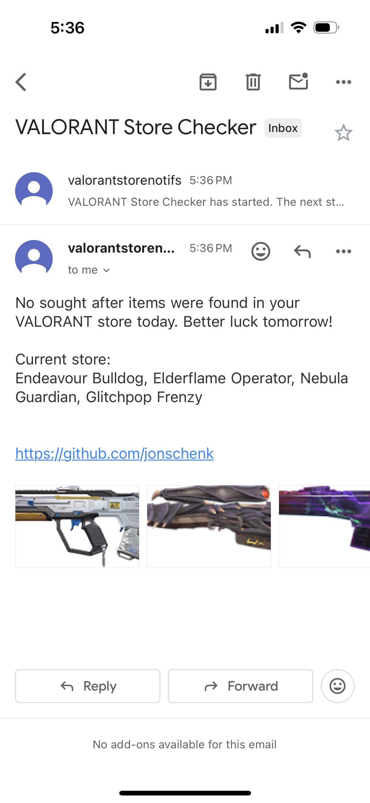

# VALORANT Store Checker

This project checks the VALORANT store for specific skins and sends an email notification if any of the desired skins are available. Never miss that Prime Vandal ever again!

## Features

- Check the VALORANT store for specific skins.
- Send email notifications with the names of the available skins.
- Attach images of the skins in the email.

## Prerequisites

- Python 3.x
- A Gmail account for sending emails

## Installation

1. Clone the repository:

    ```sh
    git clone https://github.com/jonschenk/valorant-store-checker.git
    cd valorant-store-checker
    ```

2. Install the required dependencies:

    ```sh
    pip install -r requirements.txt
    ```

## Configuration

### Setting Up Google Email

To use a Gmail account for sending emails, you need to enable 2-Factor Authentication (2FA) and create an app password.

1. **Enable 2FA**:
    - Go to your Google Account settings.
    - Navigate to the "Security" tab.
    - Under "Signing in to Google," select "2-Step Verification" and follow the instructions to set it up.

2. **Create an App Password**:
    - After enabling 2FA, go back to the "Security" tab.
    - Under "Signing in to Google," select "App passwords."
    - Select "Mail" as the app and "Other" as the device, then enter a custom name (e.g., "VALORANT Store Checker").
    - Click "Generate" and note down the app password provided.

### Creating the Configuration File

Create a `config.json` file in the root directory of the project with the following content:

```json
{
    "USRNAME": "your_valorant_username",
    "PASSWORD": "your_valorant_password",
    "FROM_EMAIL": "your_email@gmail.com",
    "TO_EMAIL": "recipient_email@gmail.com",
    "EMAIL_PASSWORD": "your_email_app_password",
    "SKIN_IDS": [
        "skin_uuid_1",
        "skin_uuid_2"
    ]
}

```

### Skin UUIDs

A comprehensive list of VALORANT skin UUIDs can be found [here](https://gist.github.com/clap-dev/fdef6cf3a689a6da2cef7da90c36adfb). Make sure you are selecting the base variation of the skin and no "Level #" variants.

### Usage

Run the script:
```sh
python store_checker.py
```

Key commands:
`r`: Manually refresh the store
`esc`: end the script


### Demo Screenshot
